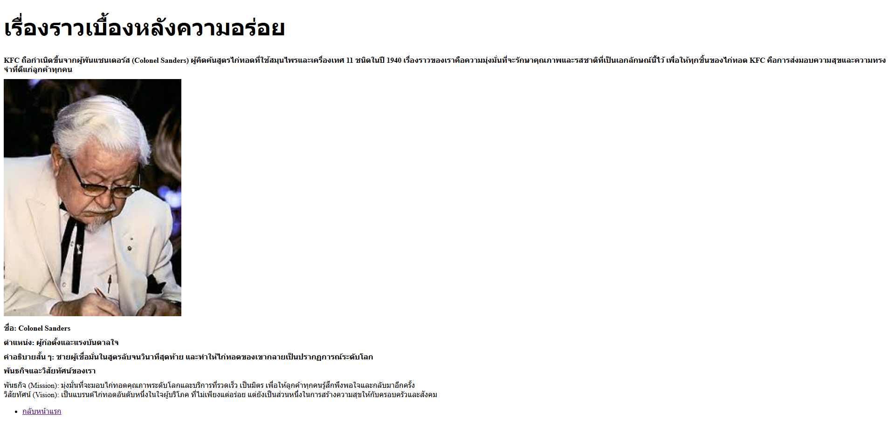
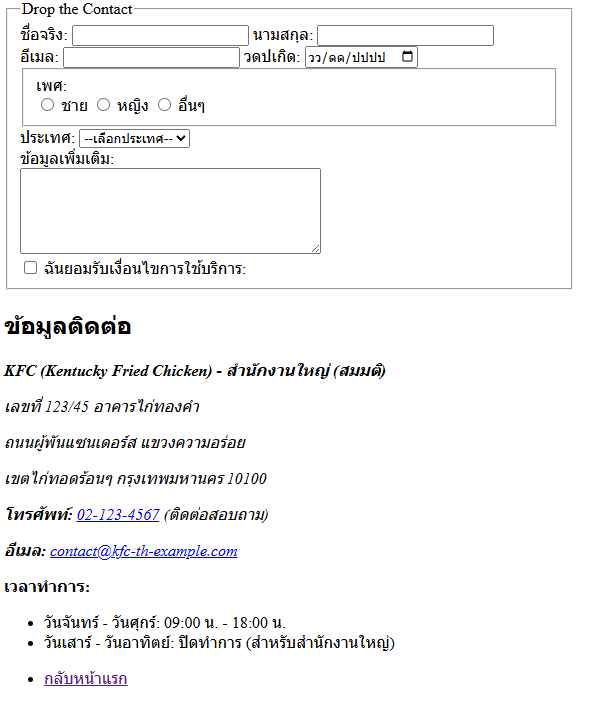

# 🍔 My Business Web - KFC Edition

## 💡 คำอธิบายโครงการ

* เว็บไซต์ธุรกิจของ **KFC** (Kentucky Fried Chicken) สาขา [ระบุชื่อสาขา/โครงการ]
* สร้างขึ้นเพื่อทำความเข้าใจการสร้างเว็บไซต์แบบพื้นฐาน การสร้างหน้าเว็บที่เรียบง่าย และการลิงก์ระหว่างหน้า
* เน้นการใช้ HTML Semantic (โดยยังไม่ใช้ CSS หรือ JavaScript ในการจัดรูปแบบหลัก)
* เรียนรู้การจัดหน้าเว็บ การลิงก์ระหว่างหน้า และการใช้องค์ประกอบพื้นฐานของ HTML

## 📁 ไฟล์ที่สร้าง

* **index.html** - หน้าแรกของเว็บไซต์ KFC แสดงส่วน Hero, บริการเด่น, และ Footer
* **about.html** - หน้าข้อมูลเกี่ยวกับ KFC: เรื่องราวความเป็นมา, ทีมงาน, และพันธกิจ/วิสัยทัศน์
* **services.html** - หน้าแสดงรายการบริการและเมนูต่าง ๆ รวมถึงตารางเปรียบเทียบชุดจัดเลี้ยง
* **contact.html** - หน้าติดต่อเรา มีฟอร์มติดต่อออนไลน์ ที่อยู่สาขา และแผนที่

## 🌐 โครงสร้างหน้าเว็บ (ตามความต้องการของลูกค้า)

### 1. หน้าแรก (index.html)
* 1.1 Header (Logo/ชื่อบริษัท)
* 1.2 Navigation menu (หน้าแรก, เกี่ยวกับ, บริการ, ติดต่อ) ลิงก์ไปยังหน้าต่าง ๆ
* 1.3 Hero section (ขนาดใหญ่ เนื้อหา Welcome)
* 1.4 Featured services (3 บริการหลัก)
* 1.5 Footer

### 2. หน้า About (about.html)
* 2.1 เรื่องราวของบริษัท
* 2.2 ทีม (ใช้ `<figure>` สำหรับแต่ละคน)
* 2.3 Mission/Vision
* 2.4 Link กลับหน้าแรก

### 3. หน้า Services (services.html)
* 3.1 รายการบริการ
* 3.2 ใช้ `<section>` สำหรับแต่ละบริการ
* 3.3 Table เปรียบเทียบแพ็กเกจ (ข้อมูลชุดจัดเลี้ยง)

### 4. หน้า Contact (contact.html)
* 4.1 มี Contact Form สำหรับป้อนข้อมูล (จากโค้ดที่ให้มา)
* 4.2 ที่อยู่ของบริษัท (ข้อมูลที่อยู่, โทรศัพท์, อีเมล, เวลาทำการ)
* 4.3 แผนที่ (embed Google Maps ถ้าทำได้)

## 🔗 All pages with direct links

| หน้า | ลิงก์ | รูปภาพ (สมมติ) |
| :--- | :--- | :--- |
| **[หน้าแรก](index.html)** | `index.html` |  |
| **[เกี่ยวกับ](about.html)** | `about.html` |  |
| **[บริการ](services.html)** | `services.html` |  |
| **[ติดต่อ](contact.html)** | `contact.html` |  |
## 🚀 How to Run

1.  เปิด `index.html` ใน Browser (สำหรับใช้งานแบบพื้นฐาน)
2.  หรือ เปิดโดยใช้ Live Server ใน VS Code (แนะนำสำหรับการพัฒนา)